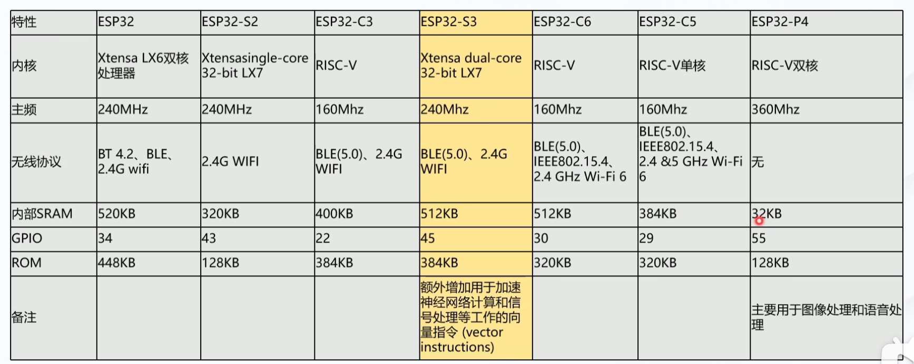
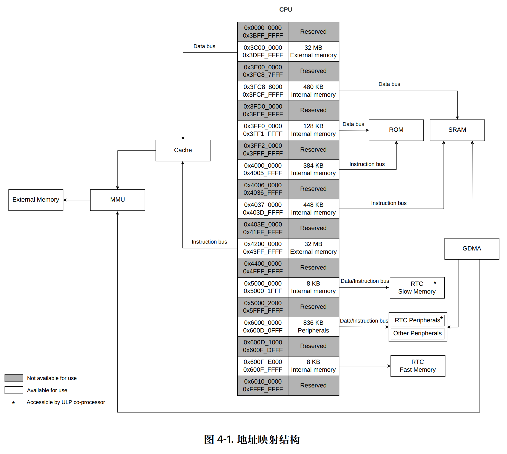

### 一、 内部 ROM (Internal ROM) - 总计 384 KB

内部 ROM 是只读的，出厂后不可编程 [cite: 144]。它里面固化了系统底层的软件代码，比如程序指令和一些必须的只读数据（例如系统 Bootloader 的核心部分） [cite: 144]。

为了配合哈佛架构的特性，它在物理上被分为了两块：

* **Internal ROM 0 (256 KB)**：这部分非常纯粹，CPU **只能通过指令总线**来访问它 [cite: 168]。它的地址范围是从 `0x4000_0000` 到 `0x4003_FFFF` [cite: 164]。
* **Internal ROM 1 (128 KB)**：这部分相对灵活，CPU 既可以通过指令总线（地址 `0x4004_0000` ~ `0x4005_FFFF`）访问，也可以通过数据总线（地址 `0x3FF0_0000` ~ `0x3FF1_FFFF`）访问 [cite: 155, 164, 170]。无论用哪条总线，读取到的物理数据是完全对应的（同序访问）。

---

### 二、 内部 RAM - 总计 528 KB

内部 RAM 是易失性的，但速度极快（通常只需一个 CPU 时钟周期就能响应） [cite: 145]。它被划分为两套系统：常规的 **Internal SRAM** 和用于低功耗的 **RTC Memory**。

#### 1. 内部静态存储器 (Internal SRAM) - 512 KB
这是你写代码时最常打交道的内存区域，它被巧妙地切分成了三块，以支持 Cache 和代码追踪功能：

* **Internal SRAM 0 (32 KB)**：
    * **访问限制**：只能通过指令总线访问 。
    * **特殊用途**：这 32 KB 可以被拿来“变身”为指令缓存（ICache），专门用来缓存外部 Flash 或外部 RAM 里的指令代码 。你可以配置占用 16 KB 或全部 32 KB；一旦被 Cache 占用，CPU 就不能再把这块区域当做普通内存访问了 。
* **Internal SRAM 1 (416 KB)**：
    * **主力军**：这是最大的一块内存，CPU 可以通过数据总线或指令总线访问它 。它是由多个 8 KB 和 16 KB 的子存储器拼起来的 。
    * **特殊用途**：你可以从中划分出最多 16 KB 作为 Trace Memory，用于 CPU 的代码执行轨迹追踪（Trace）调试，而且被划分为 Trace Memory 后，CPU 依然可以访问它 。
* **Internal SRAM 2 (64 KB)**：
    * **访问限制**：只能通过数据总线访问 [cite: 180]。
    * **特殊用途**：与 SRAM 0 类似，这部分可以被配置为数据缓存（DCache），用来缓存外部存储器中的数据 [cite: 181]。它可以配置为占用 32 KB 或全部 64 KB [cite: 181]。

#### 2. 实时时钟存储器 (RTC Memory) - 16 KB
这也是 SRAM 技术，但它的超能力在于：**当芯片进入 Deep Sleep（深度睡眠）模式、关闭绝大部分电源时，放在这里的数据依然不会丢失** [cite: 150]。

* **RTC FAST Memory (8 KB)**：
    * **访问权限**：只允许 CPU 访问，协处理器（ULP）无法访问 [cite: 151]。
    * **用途**：常用于存放深度睡眠唤醒后，需要立刻执行的核心程序指令和关键数据 [cite: 151]。
* **RTC SLOW Memory (8 KB)**：
    * **访问权限**：CPU 和 ULP 协处理器都可以访问 。
    * **用途**：它是主 CPU 和超低功耗协处理器之间沟通的“桥梁”，用于存放两者需要共享的指令和数据 。此外，CPU 甚至可以把它当做一个普通的外设模块来访问（地址段 `0x6002_1000` ~ `0x6002_2FFF`） 。